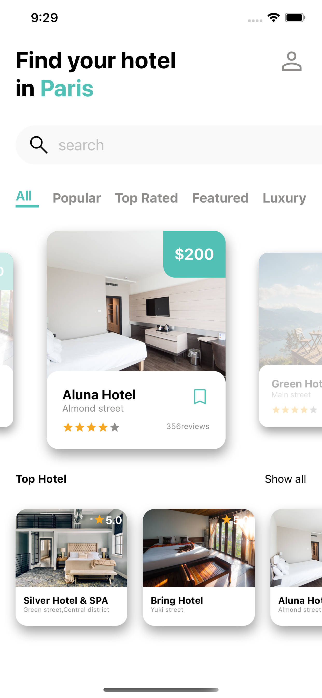
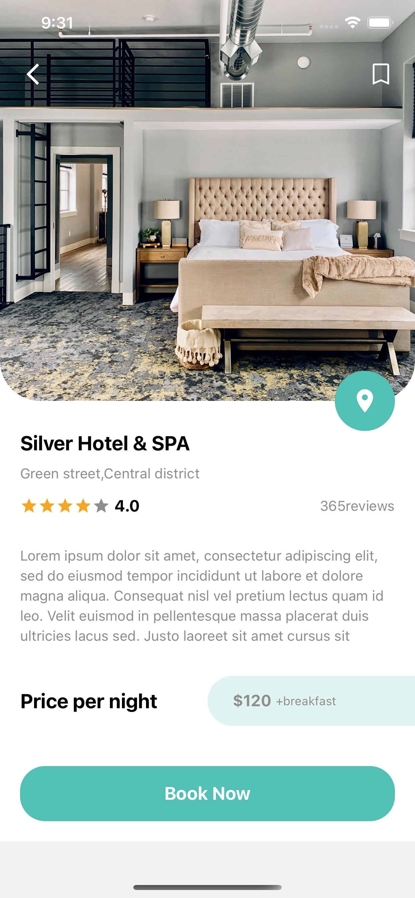

# play_with_reactnative_hotel-app
Inspiration from figma community UI

## Description

Inspiration from figma community UI

## Installation

To run the project locally, follow these steps:

1. Clone the repository: `git clone https://github.com/elroypeter/play_with_reactnative_coffee-shop.git`
2. Navigate to the project directory: `cd play_with_reactnative_coffee-shop`
3. Install dependencies: `npm install`
4. Start the development server: `npm start`
5. Follow the instructions to launch the app on your desired device/emulator.

## Screenshots

> Home Screen

> Details Screen

## Technologies Used

- React Native
- Typescript
- ReactNavigation
- CSS/StyleSheet

## Contributing

Contributions to this project are welcome. If you find any issues or have suggestions for improvements, please submit an issue or create a pull request.

## License

This project is licensed under the [MIT License](LICENSE).
